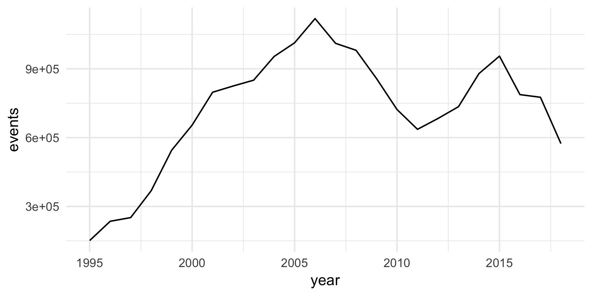
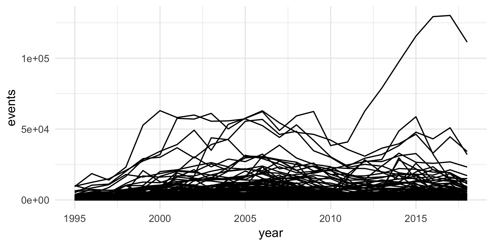

The ICEWS event data are one of the major event data sources publicly available, currently providing more than 17 million events from 1995 to late 2018 for more than 198 independent countries. The data were at first delivered with a one-year delay, but since late 2018 are available with monthly updates and no embargo period. 

The data are delivered via Dataverse, an open-source research data sharing platform. The main repository at https://doi.org/10.7910/DVN/28075 contains documentation and data in the form of 20+ data files covering each year from 1995 to the present.^[Another repository at https://doi.org/10.7910/DVN/QI2T9A has been providing daily data updates since October 2018, however the icews package is not yet setup to work with these as well.] Although it is straightforward to bulk-download the entire repository, the data files are contained in a mix of ".tab" and zippes ".tab.zip" files, file versions can change and minimally change every month for the data file for the current year, and the bulk-download itself is several GB in size. 

The icews package provides several features to make it easier to work with the ICEWS event data:

- **programmatic download** of the event data to a user-specified location that can be persisted between R sessions via relevant ".Rprofile" entries (see [setup_icews](https://www.andybeger.com/icews/reference/setup_icews.html))
- **keep an updated local copy** of the event data, with new downloads or updates in place as needed when new files or file versions are available on dataverse (see [update_icews](https://www.andybeger.com/icews/reference/update_icews.html))
- the option to keep either only the data files, or a SQLite database containing the data, or both
- **data helpers** for reading the entire data into memory ([read_icews](https://www.andybeger.com/icews/reference/read_icews.html)), regardless of the backend used (files or database), read and properly format a single data file ([read_events_tsv](https://www.andybeger.com/icews/reference/read_events_tsv.html)), or connect ([connect](https://www.andybeger.com/icews/reference/connect.html)) or directly query the database ([query_icews](https://www.andybeger.com/icews/reference/query_icews.html))

## Setup and data acquisition

The package is setup primarily with the intention that a SQLite database will be used to store the events. A more minimalist, alternative workflow is to work with the raw tab-separated data files only. 

At the moment, there isn't really any advantage to using the database option over working with the raw files. It takes around 2 minutes for my laptop to read the raw data into memory, which itself takes up a bit over 2 GB of space, but once that is done it is easy to work interactively with the data in R. With indices, the database takes up a larger space on disk, more than 8 GB, and the queries themselves should take longer than in-memory work. But for a specific query with the right indices in the database, it is probably faster to use SQL than to load the whole data into memory and then do the query/data transformations. 

The most flexible, and recommended option, is to use both files and database. Usually the several GB of extra space this takes up is not a constraint. The next three sections will cover the intial setup and subsequent workflow for the recommended dual, and database or files-only workflows. 

*Note: the package is inherently unfriendly to a completely replicable workflow, as it is setup with the intention that one will use R options set in .Rprofile at each session start. And in any case, it is not trivial to throw around 5 GB of data.*

*One side effect is that several parts of this vignette incorporte results from the local data copy I have, but which is not included on GitHub or the package install. However, I have tried to make the code here as explicity and replicable as possible.*

### Recommended: use database and retain files

First, load some libraries required for this and the remainder of the vignette:


```r
suppressPackageStartupMessages({
  library("icews")
  library("dplyr")
  library("ggplot2")
})
```

Assuming this is the first time the icews package has been loaded, start by setting the option variables that the package will use to determine what kind of backend to use and where to keep files:


```r
setup_icews("~/path/to/icews_data", use_db = TRUE, keep_files = FALSE,
            r_profile = TRUE)
```

The first argument is the path to the directory where ICEWS data will be kept. Several subdirectories will be created in this directory:

- `raw`: store for the raw, unzipped ".tab" files
- `db`: contains `icews.sqlite3`, the database
- `docs`: ICEWS documentation and metadata (changelog)

No other files should be placed in these directories, as this may break the package functionality. 

The "use_db" and "keep_files" arguments are both set to true. If "use_db" is false, a files-only option is used, regardless of what "keep_files" is set at. The final, "r_profile", option will print instructions for what needs to be added to ".Rprofile" to persist the option settings, and, if [usethis](https://cran.r-project.org/package=usethis) is installed, open the ".Rprofile" file. It should produce output like this:

```
Add these lines to the .Rprofile file:

# ICEWS data location and options
options(icews.data_dir   = "~/path/to/icews_data")
options(icews.use_db     = TRUE)
options(icews.keep_files = FALSE)

● Modify '/Users/andybega/.Rprofile'
● Restart R for changes to take effect
Path options are set
```

From now on, icews will know where the data lives and what to do.

Now we can start the data download. First, it might be a good idea to check what the planned changes are, which we can do by calling `update_icews` with `dryrun = TRUE`. 


```r
update_icews(dryrun = TRUE)
```

The output looks something like this:

```
File system changes:
Found 24 local data file(s)
Downloading 1 file(s)
Removing 1 old file(s)

Database changes:
Deleting old records for 1 file(s)
Ingesting records from 1 file(s)

Plan:
Download            'events.2018.20181119132436.tab'
Delete records from 'events.2018.20181010112357.tab'
Ingest records from 'events.2018.20181119132436.tab'
Remove              'events.2018.20181010112357.tab'
```

The initial download should take quite some time, around an hour or so. But any subsequent updates will only download files or make changes in two instances: a completely new data file is available on Dataverse, e.g. if a new year has started, or an existing file/event set with a new version is available on Dataverse, in which case the existing file and records will be updated in place with the new version. Let us now do the actual sync:


```r
update_icews()
```

That's it. To work with the data, there now several options. Read the whole data into memory:


```r
events <- read_icews()
```

Read only a single file, e.g. just to explore some of the data:


```r
events <- read_events_tsv(list_local_files()[1])
```

Connect to the database and use with with DBI or dplyr, or just plain SQL: 


```r
con <- connect()
events <- DBI::dbGetQuery(con, "SELECT * FROM events LIMIT 5;")

events <- query_icews("SELECT * FROM events LIMIT 5;")

events <- tbl(con, "events") %>% head(5) %>% collect()
```


### Database-only setup

For this workflow, we will setup the options to use a database to store the events, and to discard the raw data files. 


```r
setup_icews("~/path/to/icews_data", use_db = TRUE, keep_files = FALSE,
            r_profile = TRUE)
```

`update_icews` will now download the ".tab" data files to a temporary file and ingest from there. This saves about 5GB of space as of late 2018. 

### Files-only setup

Again, we start with the setup function and add the relevant options to the ".Rprofile" file in order to avoid having to deal with paths in future sessions.


```r
setup_icews("~/path/to/icews_data", use_db = FALSE, keep_files = TRUE,
            r_profile = TRUE)
```

`update_icews` will now only download and keep in sync the local data files. 

A completely minimalistic alternative that **does not require options to be set** is to use `download_data`:


```r
old_opts <- unset_icews_opts()
download_data(to_dir = "~/Downloads/icews_data", update = TRUE, dryrun = TRUE)
```

```
File system changes:
Found 0 local data file(s)
Downloading 24 file(s)
Removing 0 old file(s)

Plan:
Download            'events.1995.20150313082510.tab.zip'
Download            'events.1996.20150313082528.tab.zip'
...
```

## Data overview

The package includes a data sample for the 4,993 events betwen 1 and 3 June 2018. This provides an overview of the data structure:


```r
data("icews_sample")
str(icews_sample)
#> Classes 'tbl_df', 'tbl' and 'data.frame':	4993 obs. of  22 variables:
#>  $ event_id       : int  32889836 32889837 32891290 32891065 32891064 32889838 32891059 32891060 32891062 32891061 ...
#>  $ event_date     : Date, format: "2018-06-01" "2018-06-01" ...
#>  $ source_name    : chr  "Foreign Affairs (Bangladesh)" "High Ranking Military Personnel (Vietnam)" "Ministry (Japan)" "Japan" ...
#>  $ source_sectors : chr  "Executive,Foreign Ministry,Government" "Military,Government" "Government" NA ...
#>  $ source_country : chr  "Bangladesh" "Vietnam" "Japan" "Japan" ...
#>  $ event_text     : chr  "Consult" "Consult" "Consider policy option" "Express intent to engage in diplomatic cooperation (such as policy support)" ...
#>  $ cameo_code     : chr  "040" "040" "014" "032" ...
#>  $ intensity      : num  1 1 0 4.5 4.5 0 3 4 2.5 4 ...
#>  $ target_name    : chr  "High Ranking Military Personnel (Vietnam)" "Foreign Affairs (Bangladesh)" "Citizen (Japan)" "Vietnam" ...
#>  $ target_sectors : chr  "Military,Government" "Executive,Foreign Ministry,Government" "General Population / Civilian / Social,Social" NA ...
#>  $ target_country : chr  "Vietnam" "Bangladesh" "Japan" "Vietnam" ...
#>  $ story_id       : int  47400351 47400351 47400357 47400359 47400359 47400360 47400361 47400361 47400361 47400361 ...
#>  $ sentence_number: int  2 2 5 2 2 3 2 3 3 3 ...
#>  $ publisher      : chr  "Vietnam News Agency Bulletin" "Vietnam News Agency Bulletin" "Mainichi Daily News" "Vietnam News Agency Bulletin" ...
#>  $ city           : chr  "Hanoi" "Hanoi" "Osaka" NA ...
#>  $ district       : chr  NA NA "Osaka-shi" NA ...
#>  $ province       : chr  "Thanh Pho Ha Noi" "Thanh Pho Ha Noi" "Osaka-fu" NA ...
#>  $ country        : chr  "Vietnam" "Vietnam" "Japan" "Japan" ...
#>  $ latitude       : num  21 21 34.7 35.6 21 ...
#>  $ longitude      : num  106 106 136 140 106 ...
#>  $ year           : int  2018 2018 2018 2018 2018 2018 2018 2018 2018 2018 ...
#>  $ yearmonth      : int  201806 201806 201806 201806 201806 201806 201806 201806 201806 201806 ...
```


The country column includes short country names for a slightly expanded version of the countries and territories with an [ISO 3166-1](https://en.wikipedia.org/wiki/ISO_3166-1) code.^[At least it appears to be this.]. 

### Format differences between the raw data and database version

By default when importing data, and always in the database, column names are normalized by converting to lower case and replacing white space with underscore, e.g. "Event ID" becomes "event_id". 

In regard to column data types, the "event_date" column on import is converted to an R Date class vector. SQLite does not have a date data type. There is some limited support for dates in standard character format, e.g. YYYY-MM-DD, but the event dates are instead stored as integers with format YYYYMMDD in the database since the associated index is faster. 

### Some example queries

The next section below gives a more thorough overview of the ICEWS data; here are some simple example transformations of the data, with several alternative ways to do each. 

First, the total number of events per year, with three different methods giving equivalent results:


```r
# SQL
events1 <- query_icews("SELECT year, count(*) as events
                        FROM events 
                        GROUP BY year;")

# dplyr
events2 <- tbl(connect(), "events") %>%
  group_by(year) %>%
  summarize(events = n()) %>%
  collect()

# read-in memory then dplyr
events3 <- read_icews() %>%
  group_by(year) %>%
  summarize(events = n())

# plot the country series
ggplot(events1, aes(x = year, y = events)) +
  geom_line() +
  theme_minimal()
```




Next we will do country-year totals, using the ICEWS country column.


```r
# SQL
events1 <- query_icews("SELECT country, year, count(*) as events
                        FROM events 
                        GROUP BY year, country;")

# dplyr
events2 <- tbl(connect(), "events") %>%
  group_by(year, country) %>%
  summarize(events = n()) %>%
  collect()

# read-in memory then dplyr
events3 <- read_icews() %>%
  group_by(year, country) %>%
  summarize(events = n())

# plot the country series
ggplot(events1, aes(x = year, y = events, group = country)) +
  geom_line() +
  theme_minimal()
```



The ICEWS country names, and the ISO standard they are derived from, for state-centric analysis and data aggregations: (1) they tend to disregard states that do not exist anymore, e.g. Yugoslavia, and state changes in general, and (2) a lot of non-independent territories are treated separately from their associated states, e.g. Puerto Rico, American Samoa, etc. have seperate designations from the US. The Gleditsch and Ward (GW) list of independent states^[See http://ksgleditsch.com/statelist.html and https://doi.org/10.1080/03050629908434958.], which extends and improves upon the Correlates of War (COW) state list^[See "State System Membership" at http://www.correlatesofwar.org/data-sets.], provides an alternative coding that aims to capture independent states and preserve historical accuracy. 


```r
data("cameo_codes")
events <- query_icews("SELECT event_date, country FROM events;")
gw_totals <- events %>%
  mutate(
    # convert integer to proper Date
    event_date = as.Date(as.character(event_date), format = "%Y%m%d", 
                         origin = "1970-01-01"),
    # translate country to GW codes
    gwcode = icews_to_gwcode(country, event_date),
    # extract year for aggregation
    year = as.integer(format(event_date, "%Y"))
  ) %>%
  group_by(gwcode, year) %>%
  summarize(events = n())

# plot the GW country series
ggplot(gw_totals, aes(x = year, y = events, group = gwcode)) +
  geom_line() +
  theme_minimal()
```


